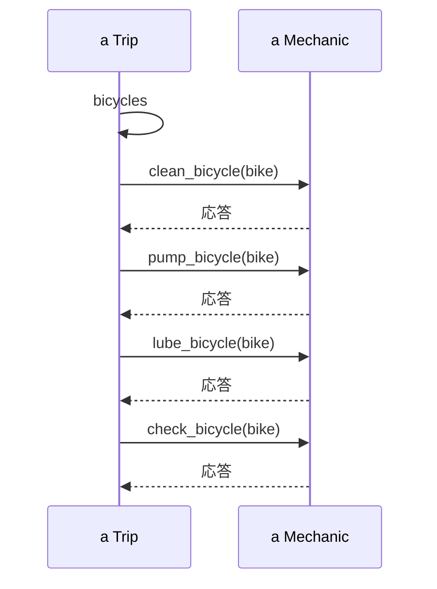
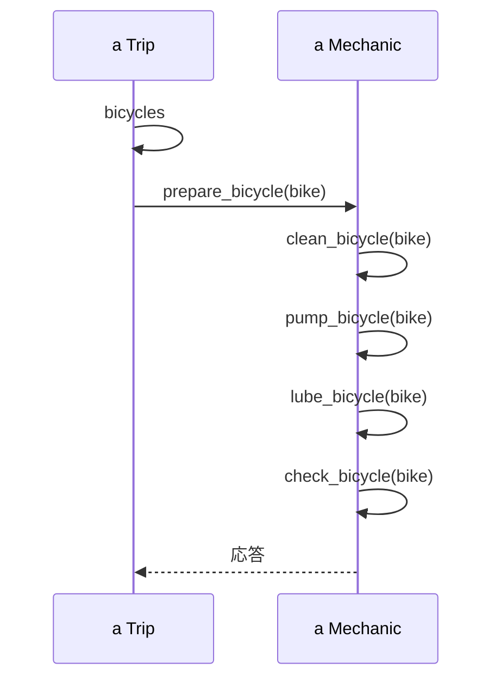
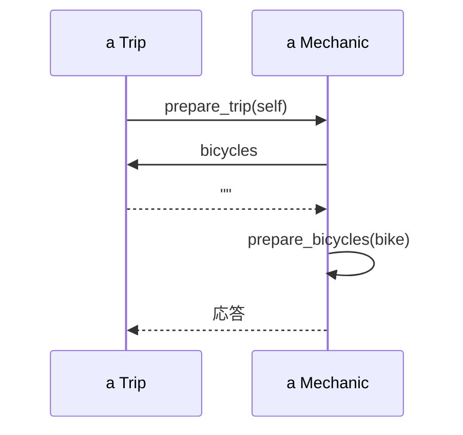

# 柔軟なインターフェースの作成

## インターフェースの理解と定義

インターフェースは、オブジェクト間の通信を定義する重要な概念だ。

### パブリックインターフェースとプライベートインターフェース

| 種類                         | 説明                                                             |
| ---------------------------- | ---------------------------------------------------------------- |
| パブリックインターフェース   | 外部から呼び出し可能なメソッド群。クラスの主要な責任を表現する。 |
| プライベートインターフェース | クラス内部でのみ使用されるメソッド群。実装の詳細を隠蔽する。     |

### 責任、依存関係、インターフェース

- 責任：クラスが果たすべき役割
- 依存関係：クラス間の関係性
- インターフェース：責任を果たし、依存関係を管理するための手段

## パブリックインターフェースの設計

### シーケンス図の活用

シーケンス図は、オブジェクト間の相互作用を時系列で表現する図だ。インターフェース設計に非常に有効なツールとなる。

#### シーケンス図の利点

1. オブジェクト間の関係性を視覚化できる
2. メッセージの流れを明確に把握できる
3. 不必要な依存関係を発見しやすい

### 設計原則

1. 「どのように」ではなく「何を」を伝える

図 1 Trip が Mechanic にどのように Bicycle を整備するかを伝える

Trip は Mechanic が行うことについて、詳細をいくつも知っている。
Mechanic のメソッドに変更があった場合に、Trip 側で新しいメソッドを実行するようにしないといけない。

図 2 Trip は Mechanic にそれぞれの Bicycle を準備するように頼む

Trip は Mechanic にそれぞれ Bicycle を準備するように頼み、実装の詳細は Mechanic に任せている
「どのように」を知る責任は Mechanic に渡された。（Trip は Mechanic にどんな改善があろうと、正しい振る舞いを得ることができる）

2. コンテキストの独立を模索する

図 3 Trip が Mechanic に Trip を準備するように頼む

Trip は Mechanic について何も知らない

Trip は Mechanic に何を望むかを伝え、self を引数として渡す。すると、Mechanic は準備が必要な Bicycle の集まり（bicycles）を得るために直ちに Trip にコールバックする。

整備士がどのようにするかは Mechanic 内に隔離されて Trip のコンテキストも削減されている

3. 他のオブジェクトを信頼する

   - 不必要に他のオブジェクトの内部動作に介入しない

4. メッセージを基本としたアプリケーション設計
   - オブジェクト間のメッセージの流れを中心に設計を行う

## 良質なインターフェースの実装

1. 明示的なインターフェースの作成

   - パブリックメソッドを明確に定義し、ドキュメント化する

2. 他のパブリックインターフェースへの敬意

   - 他のクラスのパブリックインターフェースを尊重し、不必要な依存を避ける

3. プライベートインターフェースへの依存を最小限に
   - プライベートメソッドへの依存は、変更に弱いコードを生む

## デメテルの法則

デメテルの法則は、オブジェクト間の結合度を低く保つための指針だ。

### 定義

「直接の友人とだけ話すべき」という原則。

### 違反の影響

- コードの結合度が高くなる
- 変更の影響範囲が広がる

### 違反の回避方法

1. メソッドチェーンを避ける

   - 例：`a.b().c().d()` ではなく `a.get_d()`

2. 適切な責任の分配
   - 必要な情報を持つオブジェクトに適切なメソッドを配置

## まとめ

柔軟なインターフェースの設計は、シーケンス図などのツールを活用し、適切な設計原則に従うことで達成できる。デメテルの法則を意識し、オブジェクト間の不必要な結合を避けることで、保守性と拡張性の高いコードを書くことができる。
