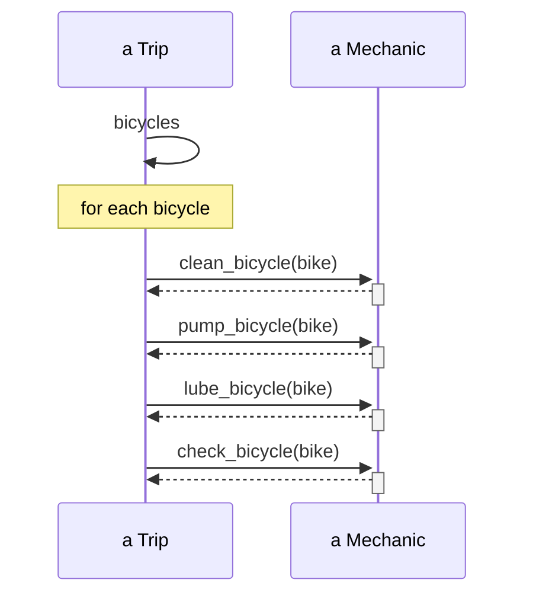
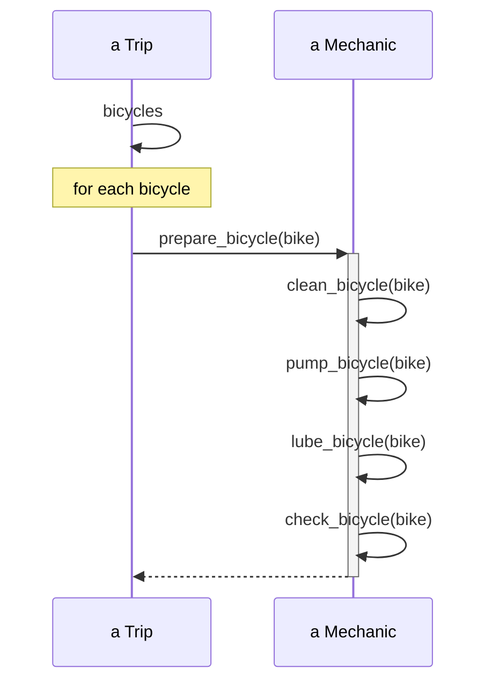
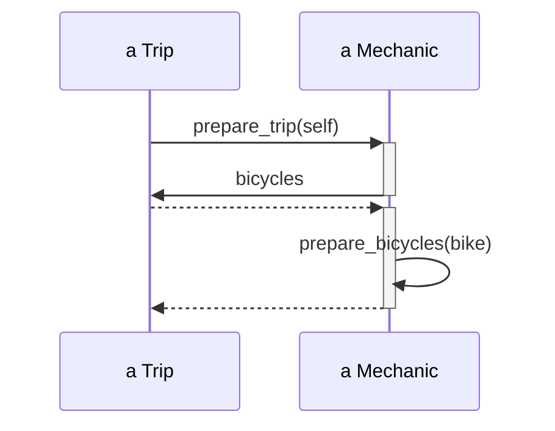
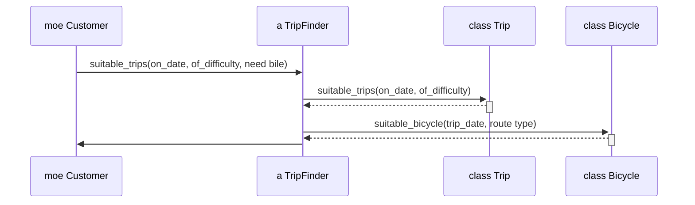

# 柔軟なインターフェースの作成

## インターフェースの理解と定義

インターフェースは、オブジェクト間の通信を定義する重要な概念だ。

### パブリックインターフェースとプライベートインターフェース

| 種類                         | 説明                                                             |
| ---------------------------- | ---------------------------------------------------------------- |
| パブリックインターフェース   | 外部から呼び出し可能なメソッド群。クラスの主要な責任を表現する。 |
| プライベートインターフェース | クラス内部でのみ使用されるメソッド群。実装の詳細を隠蔽する。     |

### 責任、依存関係、インターフェース

- 責任：クラスが果たすべき役割
- 依存関係：クラス間の関係性
- インターフェース：責任を果たし、依存関係を管理するための手段

## パブリックインターフェースの設計

### シーケンス図の活用

シーケンス図は、オブジェクト間の相互作用を時系列で表現する図だ。インターフェース設計に非常に有効なツールとなる。

#### シーケンス図の利点

1. オブジェクト間の関係性を視覚化できる
2. メッセージの流れを明確に把握できる
3. 不必要な依存関係を発見しやすい

### 設計原則

#### 1. 「どのように」ではなく「何を」を伝える

**「私は自分が何を望んでいるかを知っているし、あなたがそれをどのようにやるかも知っているよ」**



**図 1 Trip が Mechanic にどのように Bicycle を整備するかを伝える**

Trip は Mechanic が行うことについて、詳細をいくつも知っている。
Mechanic のメソッドに変更があった場合に、Trip 側で新しいメソッドを実行するようにしないといけない。

**「私は自分が何を望んでいるかを知っていて、あなたが何をするかも知っているよ」**



**図 2 Trip は Mechanic にそれぞれの Bicycle を準備するように頼む**

Trip は Mechanic にそれぞれ Bicycle を準備するように頼み、実装の詳細は Mechanic に任せている
「どのように」を知る責任は Mechanic に渡された。（Trip は Mechanic にどんな改善があろうと、正しい振る舞いを得ることができる）

**prepare_bicycle に応答できる Mechanic のようなオブジェクトを用意しなければ、Trip を再利用するのは不可能**(Trip は「常に」prepare_bicycle メッセージを自身の Mechanic へ送らないといけない)

**オブジェクトが要求するコンテキストは、オブジェクトの再利用がどれだけ難しいかに直接関係する。**

#### 2. コンテキストの独立を模索する

Trip は、コンテキスの独立を保ちながら、Mechanic と共同作業がしたい

**「私は自分が何を望んでいるかを知っているし、あなたがあなたの担当部分をやってくれると信じているよ」**



**図 3 Trip が Mechanic に Trip を準備するように頼む**

Trip は Mechanic について何も知らない

Trip は Mechanic に何を望むかを伝え、self を引数として渡す。すると、Mechanic は準備が必要な Bicycle の集まり（bicycles）を得るために直ちに Trip にコールバックする。

整備士がどのようにするかは Mechanic 内に隔離されて Trip のコンテキストも削減されている

#### 3. 他のオブジェクトを信頼する

- 図１
  - 手続型。初心者がやりがち
- 図２
  - Trip は Mechanic に Bicycle を準備するように頼んでいる。
  - Trip のコンテキスト少ない
  - Mechanic パブリックインターフェースは疎結合で、再利用もしやすい
  - Trip は prepare_bicycle に応答できるオブジェクトを自身が保持していることを知っている
    - 「常に」そのオブジェクトを持ちつづける必要がある
- 図３
  - Trip は自身が Mechanic を持っていることも、知りもしなければ気にもしない
  - メッセージの受け手を信頼し、適切に振舞ってくれることを期待している
  - 不必要に他のオブジェクトの内部動作に介入しない

手放しの信頼が、オブジェクト指向設計の要。「自分が何を望んでいるかを知っていて、オブジェクトを信頼して任せる」


#### 4. メッセージを基本としたアプリケーション設計



**図４ Moeが適切な旅行についてTripFinderに頼む**

適切な旅行（suitable trip）を見つける責任を、TripFinderが負っている（何がどうなれば適切な旅行になるかの知識を全て知っている）

TripFinderは、安定したパブリックインターフェースを提供し、変更しやすく乱雑な内部実装の詳細は隠している


## 一番良い面を（インターフェース）を表に出すコードを書く

#### 1. 明示的なインターフェースを作る

依存できるもの伝えることは、設計者の責任である
クラスを作る際は、毎回インターフェースを宣言する。「パブリック」インターフェースに含まれるメソッドは次のようであるべき

- 明示的にパブリックインターフェースだと特定できる
- 「どのように」よりも、「何を」になっている
- 名前は、考えられる限り、変わりえないものである
- オプション引数として、ハッシュをとる

```ruby
class Bicycle
  # パブリックインターフェースを明示的に定義
  public

  def initialize(options = {})
    @size = options[:size]
    @chain = options[:chain] || default_chain
    @tire_size = options[:tire_size] || default_tire_size
  end

  def size
    @size
  end

  def spares
    { chain: @chain, tire_size: @tire_size }
  end

  # プライベートインターフェース
  private

  def default_chain
    '10-speed'
  end

  def default_tire_size
    '23'
  end
end
```
この例では、initialize, size, sparesがパブリックインターフェースとして明示的に定義されている。これらのメソッドは「何を」するかを表現しており、実装の詳細（「どのように」）は隠蔽されている。

#### 2. 他のパブリックインターフェースへの敬意

他のクラスと協力する際は、それらのパブリックインターフェースのみを使ってベストを尽くす。
```ruby
class Trip
  def prepare(preparer)
    # preparerのパブリックインターフェースのみを使用
    preparer.prepare_trip(self)
  end
end

class TripCoordinator
  def prepare_trip(trip)
    # Tripクラスのパブリックインターフェースを通じて情報を取得
    buy_food(trip.customers)
  end

  private

  def buy_food(customers)
    # 食事の準備ロジック
  end
end
```

#### 3. プライベートインターフェースに依存する時は、注意深く
プライベートメソッドへの依存は、変更に弱いコードを生む

#### 4. コンテキストを最小限にする
パブリックメソッドを作る際は、メッセージの送り手が、クラスがどのようにその振る舞いを実装しているかを知ることなく、求めているものを得られるように作る。

パブリックインターフェースを全く持たない、もしくは定義がひどいクラスに遭遇したら、自身の手でパブリックインターフェースを作る。新しくラッパーメソッドを定義することも。

## デメテルの法則

デメテルの法則は、オブジェクト間の結合度を低く保つための指針だ。

### 定義

「直接の友人とだけ話すべき」という原則。

### 違反の影響

- コードの結合度が高くなる
- 変更の影響範囲が広がる

### 違反の回避方法

1. メソッドチェーンを避ける

   - 例：`a.b().c().d()` ではなく `a.get_d()`

2. 適切な責任の分配
   - 必要な情報を持つオブジェクトに適切なメソッドを配置

#### メッセージの委譲とラッパーメソッド
メッセージの委譲は、あるオブジェクトが受け取ったメッセージを、適切な他のオブジェクトに転送することを指す。ラッパーメソッドは、この委譲を実現するための手段の一つ。

基本的な考え方

オブジェクトAがオブジェクトBを知っている。
オブジェクトBがオブジェクトCを知っている。
オブジェクトAがCの機能を使いたい場合、直接C.method()と呼ぶのではなく、B.wrapper_method()を通じてアクセスする。

例：メソッドチェーンの問題
```ruby
class Person
  attr_reader :address
  def initialize(address)
    @address = address
  end
end

class Address
  attr_reader :street
  def initialize(street)
    @street = street
  end
end

class Street
  attr_reader :name
  def initialize(name)
    @name = name
  end
end

# デメテルの法則に違反する使用例
person = Person.new(Address.new(Street.new("Main St.")))
puts person.address.street.name  # => "Main St."
```

例：ラッパーメソッドを使用して、この問題を解決
```ruby
class Person
  attr_reader :address
  def initialize(address)
    @address = address
  end

  # ラッパーメソッド
  def street_name
    address.street_name
  end
end

class Address
  attr_reader :street
  def initialize(street)
    @street = street
  end

  # ラッパーメソッド
  def street_name
    street.name
  end
end

class Street
  attr_reader :name
  def initialize(name)
    @name = name
  end
end

# 改善された使用例
person = Person.new(Address.new(Street.new("Main St.")))
puts person.street_name  # => "Main St."
```


## まとめ

柔軟なインターフェースの設計は、シーケンス図などのツールを活用し、適切な設計原則に従うことで達成できる。デメテルの法則を意識し、オブジェクト間の不必要な結合を避けることで、保守性と拡張性の高いコードを書くことができる。

オブジェクト指向アプリケーションは、オブジェクト間で交わされるメッセージによって定義される
このメッセージ交換は「パブリック」インターフェースに沿って行われる。適切に定義されたインターフェースは、根底にあるクラスの責任をあらわにし、最大限の利益を最小限のコストで提供する安定したメソッドから成る。